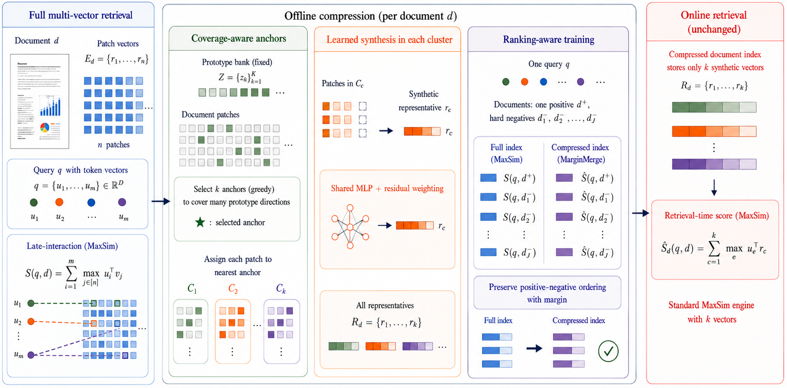

# MarginMerge

Code for "Coverage Matters: MarginMerge for Compressing Multi-Vector Visual Document Retrievers".

## Setup

The two backbones need different transformers versions, so use two envs.

    python -m venv .venv && . .venv/bin/activate
    pip install -r requirements.txt

    python -m venv .venv-colpali && . .venv-colpali/bin/activate
    pip install -r requirements-colpali.txt

The pins are not optional. transformers >= 4.49 re-initialises the PaliGemma weights
in ColPali-v1.3 without warning, which gives you garbage embeddings. Run
`python src/verify_colpali.py` before using any ColPali cache.

Imports in `src/` are flat, so run things with `export PYTHONPATH=$PWD/src`.
`tests/` needs no data:

    PYTHONPATH=src python tests/test_marginmerge.py
    PYTHONPATH=src python tests/test_gapcover.py
    PYTHONPATH=src python tests/test_factorial.py

## Running it

Encode the corpora (datasets come from the ViDoRe and HF hubs):

    python src/encode.py arxivqa docvqa infovqa flickr
    python src/encode_slices.py tatdqa tabfquad
    python src/encode_colpali.py arxivqa docvqa infovqa flickr tatdqa tabfquad

Build the prototype bank from training queries only:

    python src/build_query_prototypes.py --seed 42 --out outputs/bank_seed42.pt

Train:

    python src/train_marginmerge.py --bank outputs/bank_seed42.pt --seed 42 \
      --out outputs/marginmerge_seed42.pt

Evaluate (set MM_RHO to 0.05, 0.10 or 0.20):

    MM_RHO=0.05 python src/eval_marginmerge.py --bank outputs/bank_seed42.pt \
      --ckpt outputs/marginmerge_seed42.pt --table9 \
      --slices arxivqa docvqa infovqa tatdqa tabfquad flickr

Selection baselines, and the anchor/synthesis/loss factorial:

    python src/baselines_memory.py arxivqa docvqa infovqa tatdqa tabfquad flickr
    python src/baselines_aggregate.py
    python src/factorial_run.py --phase B
    python src/factorial_analyze.py --phase B

`factorial_run.py` skips work it has already done, so you can restart it.

## Where things are

- `gapcover.py` - coverage and anchor selection (Eq. 4-5)
- `clustering.py` - patch to anchor assignment (Eq. 6)
- `marginmerge.py` - representative synthesis (Eq. 7-9)
- `train_marginmerge.py` - hard negatives and the margin loss (Eq. 10-12)

`results/` has the aggregated numbers we report. Checkpoints and per-run dumps are not
in the repo.

## License

MIT, see [LICENSE](LICENSE).
